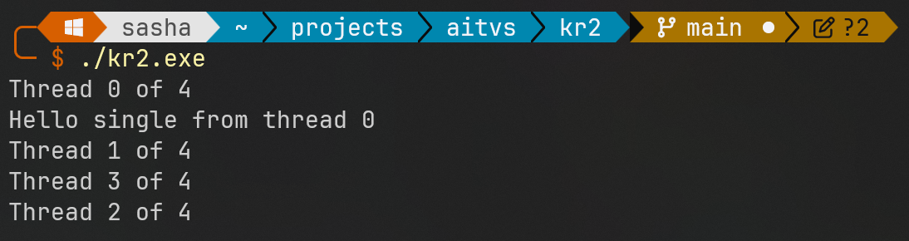

# Описание

Программа устанавливает число нитей равным 4 с помощью omp_set_num_threads. В параллельном блоке каждая нить выводит свой номер и общее количество нитей. В секции #pragma omp single одна нить выводит сообщение "Hello single" и свой номер.

# Решение

```c
#include <iostream>
#include <omp.h>

int main() {
    // Установка числа нитей
    omp_set_num_threads(4);
    #pragma omp parallel
    {
        // Получение номера нити и количества нитей
        int thread_id = omp_get_thread_num();
        int num_threads = omp_get_num_threads();

        // Вывод информации о нити
        std::cout << "Thread " << thread_id << " of " << num_threads << std::endl;

        #pragma omp single
        {
            // Вывод сообщения и номера нити, выполняющей single-секцию
            std::cout << "Hello single from thread " << omp_get_thread_num() << std::endl;
        }
    }

    return 0;
}
```

---

# Инструкции по запуску

1. Скомпилируйте программу:
```bash
g++ -fopenmp kr2.cpp -o kr2
```

2. Запустите с минимум 3 процессами:
```bash
./kr2.exe
```

