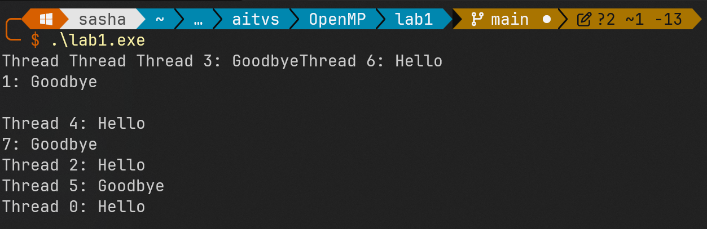
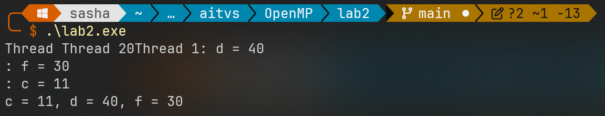
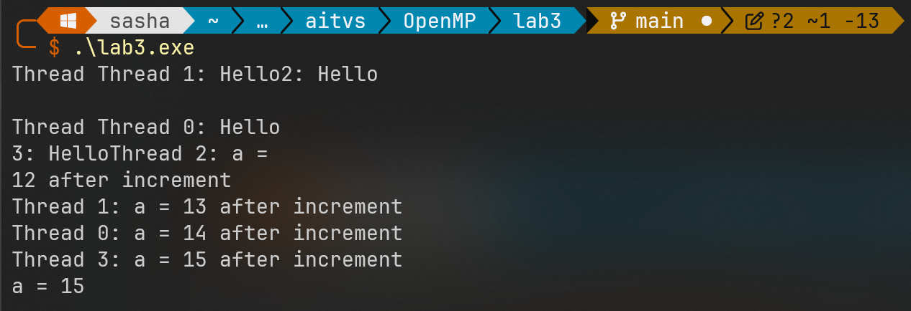

# Лабораторная работа №1: Основы OpenMP

## Сборка и запуск

**Компиляция:**

```shell
g++ -fopenmp <file>.cpp -o <file>
```

**Запуск:**

```shell
./<file>.exe
```

## Примеры

### Пример 1

**Описание:**

Организовать c помощью прагмы parallel и опции num_threads параллельную область с количеством нитей, равным 8. Каждая нить параллельного блока с четным номером должна напечатать слово “Hello”, каждая нить с нечетным номером – слово “Goodbye”.

**Код:**

```c
#include <iostream>
#include <omp.h>

int main() {    // Параллельная область с 8 потоками
    #pragma omp parallel num_threads(8)
    {
        // Получаем ID текущего потока
        int thread_id = omp_get_thread_num();

        // Четный поток - "Hello", нечетный - "Goodbye"
        if (thread_id % 2 == 0) {
            std::cout << "Thread " << thread_id << ": Hello" << std::endl;
        } else {
            std::cout << "Thread " << thread_id << ": Goodbye" << std::endl;
        }
    }
    return 0;
}
```

**Результаты:**



### Пример 2

**Описание:**

Написать OpenMP-программу, выполняющую следующее. Задаются целые переменные a = 10 и b = 20, которые являются общими для параллельной области, имеющей не менее трех нитей, организованной с помощью прагмы parallel. Внутри параллельной области c помощью прагмы sections организуются три независимых блока, в первом из которых вычисляется c = a + 1, во втором d = b * 2, в третьем f = a + b. После завершения параллельной области выводятся на экран результирующие значения c, d, f.

**Код:**

```c
#include <iostream>
#include <omp.h>

int main() {    int a = 10, b = 20, c, d, f;

    // Параллельная область с 3 потоками, a, b, c, d, f - общие
    #pragma omp parallel num_threads(3) shared(a, b, c, d, f)
    {
        // Разделяем работу на независимые секции
        #pragma omp sections
        {
            #pragma omp section
            {
                c = a + 1;
                std::cout << "Thread " << omp_get_thread_num() << ": c = " << c << std::endl;
            }

            #pragma omp section
            {
                d = b * 2;
                std::cout << "Thread " << omp_get_thread_num() << ": d = " << d << std::endl;
            }

            #pragma omp section
            {
                f = a + b;
                std::cout << "Thread " << omp_get_thread_num() << ": f = " << f << std::endl;
            }
        }
    }

    std::cout << "c = " << c << ", d = " << d << ", f = " << f << std::endl;
    return 0;
}
```

**Результаты:**



### Пример 3

**Описание:**

Написать OpenMP-программу, выполняющую следующее. Задается целая переменная a = 11, которая является общей для параллельного блока, организованного с помощью прагмы parallel. Устанавливается число нитей в параллельных фрагментах, равное 4, с помощью опции num_threads прагмы parallel. Внутри параллельного блока каждая нить печатает свой номер и организуется критическая секция c помощью прагмы critical, внутри которой к переменной a прибавляется 1. После завершения параллельного блока выводится на экран результирующее значение a.

**Код:**

```c
#include <iostream>
#include <omp.h>

int main() {
    int a = 11;

    // Параллельная область с 4 потоками, a - общая
    #pragma omp parallel num_threads(4) shared(a)
    {
        int thread_id = omp_get_thread_num();
        std::cout << "Thread " << thread_id << ": Hello" << std::endl;

        // Критическая секция - только один поток может выполнять этот код
        #pragma omp critical
        {
            a += 1;
            std::cout << "Thread " << thread_id << ": a = " << a << " after increment" << std::endl;
        }
    }

    std::cout << "a = " << a << std::endl;
    return 0;
}
```

**Результаты:**


