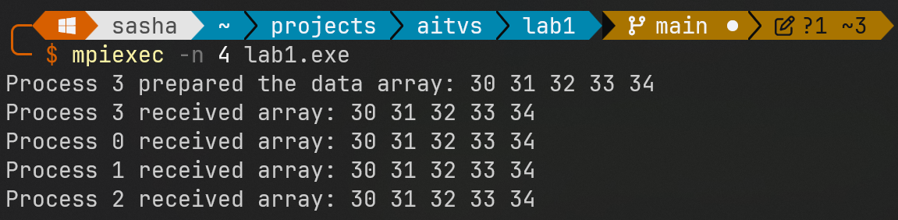
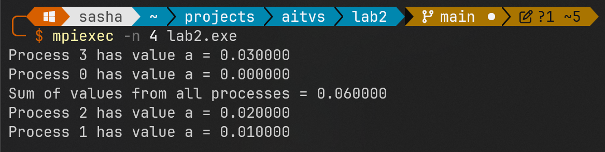

# Лабораторная работа №1: Основы MPI

## Описание

В данной лабораторной работе рассматриваются базовые принципы параллельного программирования с использованием библиотеки MPI (Message Passing Interface). Реализованы три примера, демонстрирующие рассылку данных между процессами, вычисление суммы с использованием редукции и распределение цикла для параллельной обработки массива.

## Сборка и запуск

Для компиляции и запуска примеров необходимо установить библиотеку MPI.

**Компиляция:**

```shell
gcc lab1.cpp -I"C:\Program Files (x86)\Microsoft SDKs\MPI\Include" -L"C:\Program Files (x86)\Microsoft SDKs\MPI\Lib\x64" -lmsmpi -o lab1.exe
```

**Запуск:**

```shell
mpiexec -n <количество_процессов> lab1.exe
```

Замените `<количество_процессов>` на желаемое число MPI-процессов (например, `4`).

## Примеры

### Пример 1. Рассылка массива между MPI-процессами (MPI_Bcast)

**Описание:**

В процессе с максимальным номером в группе формируется массив целых чисел (длины `ARRAY_SIZE = 5`). Затем этот массив рассылается всем процессам группы, так что каждый процесс получает копию данного массива.  Используется функция `MPI_Bcast`.

**Код:**

```c
#include <stdio.h>
#include <stdlib.h>
#include <mpi.h>

#define ARRAY_SIZE 5 // Short array size

int main(int argc, char *argv[]) {
    int rank, numprocs;
    int *array = NULL;

    MPI_Init(&argc, &argv);
    MPI_Comm_rank(MPI_COMM_WORLD, &rank);
    MPI_Comm_size(MPI_COMM_WORLD, &numprocs);

    /* The process with the highest rank creates the initial array */
    if (rank == numprocs - 1) {
        array = (int *)malloc(ARRAY_SIZE * sizeof(int));
        for (int i = 0; i < ARRAY_SIZE; i++) {
            array[i] = rank * 10 + i; // Fill with rank-specific values
        }
        printf("Process %d prepared the data array: ", rank);
        for(int i = 0; i < ARRAY_SIZE; i++) {
            printf("%d ", array[i]);
        }
        printf("\n");
    } else {
        /* Other processes allocate memory to receive the array */
        array = (int *)malloc(ARRAY_SIZE * sizeof(int));
    }

    /* Broadcast the array: all processes receive a copy of the array.
       Use MPI_Bcast, called by all processes.
       The root process is the one with rank numprocs-1 */
    MPI_Bcast(array, ARRAY_SIZE, MPI_INT, numprocs - 1, MPI_COMM_WORLD);

    /* Each process can check that the data was received correctly: */
    printf("Process %d received array: ", rank);
    for(int i = 0; i < ARRAY_SIZE; i++) {
        printf("%d ", array[i]);
    }    printf("\n");

    free(array);
    MPI_Finalize();
    return 0;
}
```

**Результаты:**



**Пояснения:**

1.  Функции `MPI_Comm_rank` и `MPI_Comm_size` используются для определения номера процесса и общего числа процессов в группе.
2.  Процесс с максимальным номером (`numprocs - 1`) формирует исходный массив.
3.  Функция `MPI_Bcast` рассылает массив от корневого процесса (в данном случае, процесс с номером `numprocs - 1`) всем остальным процессам.

### Пример 2. Параллельное вычисление суммы с использованием MPI_Reduce

**Описание:**

В каждом процессе создаётся переменная типа `double`, значение которой определяется как `0.01 * номер процесса`.  Необходимо найти сумму этих переменных с использованием процедуры `MPI_Reduce`. Результат (сумма) передаётся в процесс с номером 0. Также демонстрируется применение функций `MPI_Comm_rank`, `MPI_Comm_size`.

**Код:**

```c#include <stdio.h>
#include <mpi.h>

int main(int argc, char *argv[]) {
    int rank, numprocs;
    double a, sum;

    MPI_Init(&argc, &argv);
    MPI_Comm_rank(MPI_COMM_WORLD, &rank);
    MPI_Comm_size(MPI_COMM_WORLD, &numprocs);

    /* Каждый процесс вычисляет своё значение */
    a = 0.01 * rank;
    printf("Процесс %d имеет значение a = %f\n", rank, a);

    /* Выполняется операция редукции (суммирование) */
    MPI_Reduce(&a, &sum, 1, MPI_DOUBLE, MPI_SUM, 0, MPI_COMM_WORLD);

    /* Процесс с номером 0 выводит результат */
    if (rank == 0) {
        printf("Сумма значений от всех процессов = %f\n", sum);
    }

    MPI_Finalize();
    return 0;
}
```

**Результаты:**


**Пояснения:**

1.  Использование функций `MPI_Comm_rank` и `MPI_Comm_size` обеспечивает корректное распределение вычислений среди процессов.
2.  Каждый процесс вычисляет значение `a = 0.01 * rank`.
3.  Операция редукции `MPI_Reduce` с операцией `MPI_SUM` собирает сумму всех переменных `a` в переменную `sum`, которая находится у процесса с номером 0.

### Пример 3. Распределение цикла (умножение элементов массива на константу) с использованием MPI_Scatter и MPI_Gather

**Описание:**

Имеется массив `A` длины `N = 10`, над которым необходимо выполнить умножение каждого элемента на 10. Для распределения вычислений между MPI-процессами используется блочное разбиение и функции `MPI_Scatter` и `MPI_Gather`.

**Код:**

```c
#include <stdio.h>
#include <stdlib.h>
#include <mpi.h>

int main(int argc, char *argv[]) {
    int rank, numprocs;
    int N = 10;  // маленький массив
    double *A = NULL;

    MPI_Init(&argc, &argv);
    MPI_Comm_rank(MPI_COMM_WORLD, &rank);
    MPI_Comm_size(MPI_COMM_WORLD, &numprocs);

    // Проверим, что N кратно numprocs (иначе мы сейчас не обработаем этот случай)
    if (rank == 0) {
        if (N % numprocs != 0) {
            printf("Warning! N = %d is not divisible by numprocs = %d\n", N, numprocs);
            printf("This example code expects N %% numprocs == 0\n");
        }
    }

    int chunk = N / numprocs;  // размер блока для каждого процесса

    if (rank == 0) {
        A = (double *)malloc(N * sizeof(double));
        for(int i = 0; i < N; i++) {
            A[i] = i;
        }
    }

    double *local_A = (double *)malloc(chunk * sizeof(double));

    // Рассилка блоков
    MPI_Scatter(A, chunk, MPI_DOUBLE, local_A, chunk, MPI_DOUBLE, 0, MPI_COMM_WORLD);

    // Обработка локального блока
    for(int i = 0; i < chunk; i++) {
        local_A[i] *= 10.0;
    }

    // Сбор обратно
    MPI_Gather(local_A, chunk, MPI_DOUBLE, A, chunk, MPI_DOUBLE, 0, MPI_COMM_WORLD);

    // Процесс 0 печатает весь массив
    if (rank == 0) {
        printf("Modified array A after multiplication by 10:\n");
        for (int i = 0; i < N; i++) {
            printf("%f ", A[i]);
        }
        printf("\n");
        free(A);
    }

    free(local_A);
    MPI_Finalize();
    return 0;
}
```

**Результаты:**



**Пояснения:**

- Для демонстрации применяется коммуникация MPI через функции `MPI_Scatter` и `MPI_Gather`.
- Распределение работы происходит путём деления исходного массива на непрерывные блоки (блочный принцип).
- Каждый процесс работает параллельно над своим блоком, что иллюстрирует параллельное исполнение цикла.

> [!WARNING]
> Обработка случая, когда `N` не делится на `numprocs`**
>
> В данном примере, если размер массива `N` не делится нацело на число процессов `numprocs`, то только `N - (N % numprocs)` элементов массива будут обработаны.  Последние `N % numprocs` элементов будут проигнорированы.
>
> Для корректной обработки случая, когда `N` не делится на `numprocs`, можно использовать функции `MPI_Scatterv` и `MPI_Gatherv`, которые позволяют задавать разное количество элементов для каждого процесса.

### Пример 4. Пересылка данных между двумя процессами (MPI_Send и MPI_Recv)

**Описание:**

Демонстрируется простая точечная передача данных от одного процесса к другому. В данном примере должны работать ровно два процесса. Процесс с рангом 0 отправляет целое число процессу с рангом 1, а тот его принимает и выводит на экран.

**Код:**

```c
#include <stdio.h>
#include <stdlib.h>
#include <mpi.h>

int main(int argc, char *argv[]) {
    int rank, numprocs;
    int data;
    MPI_Status status;

    MPI_Init(&argc, &argv);
    MPI_Comm_rank(MPI_COMM_WORLD, &rank);
    MPI_Comm_size(MPI_COMM_WORLD, &numprocs);

    if (numprocs != 2) {
        if (rank == 0) {
            printf("This example is intended to be run with exactly two processes.\n");
        }
        MPI_Finalize();
        return 1;
    }

    if (rank == 0) {
        data = 12345;
        printf("Process 0 sends data %d to process 1.\n", data);
        MPI_Send(&data, 1, MPI_INT, 1, 0, MPI_COMM_WORLD);
    } else if (rank == 1) {
        MPI_Recv(&data, 1, MPI_INT, 0, 0, MPI_COMM_WORLD, &status);
        printf("Process 1 received data %d from process 0.\n", data);
    }

    MPI_Finalize();
    return 0;
}
```

**Примечания:**

- Перед запуском убедитесь, что число процессов `numprocs` равно 2:  
  ```bash
  mpiexec -n 2 lab4.exe
  ```
- Если запустить с количеством процессов, отличным от 2, программа выведет предупреждение и завершится.

**Результат**


